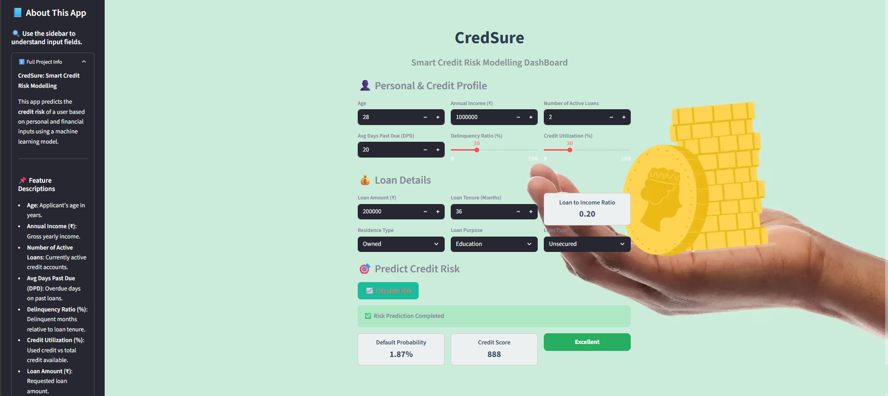

# CredSure: Smart Credit Risk Modelling 🧠📊

CredSure is an interactive Streamlit web application designed to predict **credit risk** based on user-provided personal and financial data. This tool uses a machine learning model to estimate the likelihood of default and generate a credit score and risk rating.



---

## 🚀 Features

- Predicts default probability using ML
- Calculates credit score (300–900 scale)
- Provides risk rating: Excellent, Good, Average, Poor
- Clean UI with Streamlit
- Responsive background and UI for mobile/desktop

## 🧩 How it works

Users input their financial and personal data into a form. Behind the scenes, the app performs:

1. **Preprocessing** – Missing handling, feature engineering, scaling  
2. **Prediction** – A trained logistic regression model predicts default probability  
3. **Scoring** – Converts probability into a credit score (300–900)  
4. **Rating** – Assigns one of four categories: Excellent, Good, Average, Poor

---

## 🧱 Tech Stack

- **Python**
- **Streamlit** (for UI)
- **Scikit-learn** (for ML)
- **Pandas / NumPy** (for data processing)
- **Joblib** (for model serialization)
- **Matplotlib / Seaborn** (EDA in notebooks)

---

## 📁 Folder Structure

```
credit_risk_modelling/
├── artifacts/
│ └── model_data.joblib
├── datasets/
│ └── README.txt 
├── images/
│ ├── app_image.png 
│ └── filters_format(webp)_quality(80).avif
├── notebook/
│ └── credit_risk_notebook.ipynb 
├── main.py 
├── prediction_helper.py 
├── analysis.md 
├── requirements.txt 
├── .gitignore 
└── README.md 
```

## 📦 Setup Instructions

1. Clone the repository
   git clone <repo-url>
   cd credit_risk_modelling

3. Install dependencies:  
   ```bash
   pip install -r requirements.txt
   ```
4. Run the app:  
   ```bash
   streamlit run main.py
   ```
   ---
## 🔮 Future Improvements

- [ ] Add support for more ML models (e.g., Random Forest, XGBoost)
- [ ] Integrate real-time data validation
- [ ] Include visualization of prediction insights (charts, risk distribution)
- [ ] Deploy on a cloud platform (Streamlit Cloud, Heroku, or Render)

## ⚠️ Disclaimer

- This application is built for **educational purposes only**.
- The model and data used are illustrative and **not suitable for production**.
- The dataset used is **confidential** and not uploaded publicly.

---

---

## 👤 Author

**Sarthak Maddi**  
🎓 Data Science & Machine Learning Enthusiast  
📍 India  
📫 [Connect on LinkedIn](https://www.linkedin.com/in/sarthak-maddi-126127323/) *(or update with your link)*  
💻 GitHub: [@sarthakmaddi](https://github.com/sarthak1409/)

---

> *This project is part of my learning journey in applied machine learning and credit risk analytics.*
